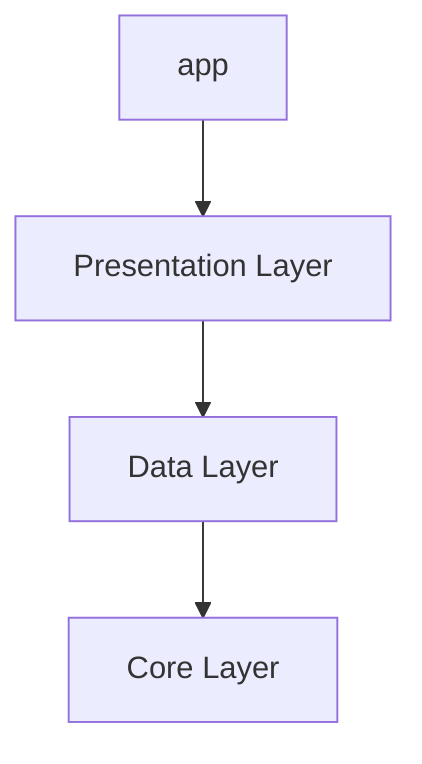
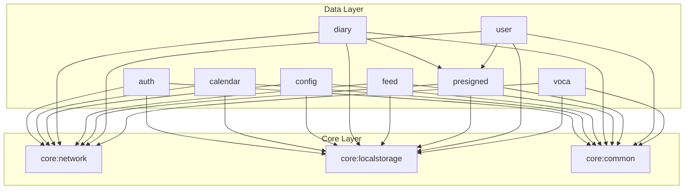
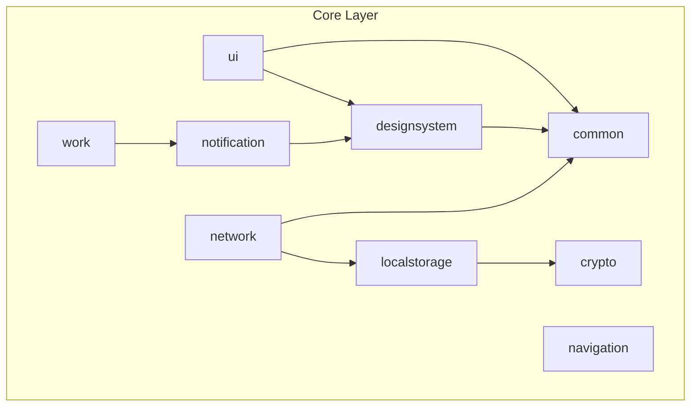

# Hi-lingual

**하이링구얼: 영어 일기, 기록**

  

> "영어를 부담스러운 공부가 아닌, 나를 표현하는 언어로 느낄 수 있도록"

하이링구얼은 일상 속 영어를 함께하는 일기 기록 서비스입니다.

- 시간에 쫓겨 영어 공부를 미루셨던 분
- 교과서 영어가 아닌 실생활 영어를 배우고 싶었던 분
- 일상 기록에 동기부여를 바라는 분

모두, 하루를 기록하며 영어를 나의 것으로 만들어보세요 😊

## Download

## Tech Stack

| Category | Stack |
| --- | --- |
| **Architecture** | Recommended App Architecture |
| **UI** | Jetpack Compose |
| **DI** | Dagger-Hilt |
| **Asynchronous** | Kotlin Coroutine, Flow |
| **Modularization** | Android App Modularization |
| **Build Configuration** | Gradle Version Catalog, Custom Convention Plugins |

## Module Dependency Graph

### High-Level Architecture

### Presentation Layer Dependencies

> **presentation:main** 모듈은 아래 그래프의 모든 Presentation 모듈을 포함하며,  
> 모든 Presentation 모듈은 공통적으로 **core:ui**와 **core:navigation** 모듈에 의존합니다.

```mermaid
graph TD
    subgraph Presentation Layer
        auth["auth"]
        diaryfeedback["diaryfeedback"]
        diarywrite["diarywrite"]
        feed["feed"]
        feeddiary["feeddiary"]
        feedprofile["feedprofile"]
        home["home"]
        mypage["mypage"]
        notification["notification"]
        signup["signup"]
        splash["splash"]
        voca["voca"]
    end

    subgraph Data Layer
        data_auth["data:auth"]
        data_calendar["data:calendar"]
        data_config["data:config"]
        data_diary["data:diary"]
        data_feed["data:feed"]
        data_user["data:user"]
        data_voca["data:voca"]
    end

    auth --> data_auth
    auth --> data_user
    diaryfeedback --> data_diary
    diarywrite --> data_calendar
    diarywrite --> data_diary
    feed --> data_feed
    feed --> data_diary
    feed --> data_user
    feeddiary --> data_diary
    feeddiary --> data_feed
    feeddiary --> data_user
    feedprofile --> data_feed
    feedprofile --> data_user
    feedprofile --> data_diary
    home --> data_user
    home --> data_diary
    home --> data_calendar
    mypage --> data_user
    mypage --> data_auth
    notification --> data_user
    signup --> data_user
    splash --> data_auth
    splash --> data_user
    splash --> data_config
    voca --> data_voca
    voca --> data_diary
```

### Data Layer Dependencies

### Core Layer Dependencies

## Contributors

<!-- ALL-CONTRIBUTORS-LIST:START - Do not remove or modify this section -->
<!-- prettier-ignore-start -->
<!-- markdownlint-disable -->
<table>
  <tbody>
    <tr>
      <td align="center" valign="top" width="14.28%"><a href="https://github.com/angryPodo"> <b>Han Minjae</b></a> <a href="https://github.com/Hi-lingual/Hilingual-Android/commits?author=angryPodo" title="Code">💻</a> <a href="#infra-angryPodo" title="Infrastructure (Hosting, Build-Tools, etc)">🚇</a> <a href="#maintenance-angryPodo" title="Maintenance">🚧</a> <a href="https://github.com/Hi-lingual/Hilingual-Android/pulls?q=is%3Apr+reviewed-by%3AangryPodo" title="Reviewed Pull Requests">👀</a>
      <td align="center" valign="top" width="14.28%"><a href="https://github.com/nahy-512"> <b>Kim Nahyun</b></a> <a href="https://github.com/Hi-lingual/Hilingual-Android/commits?author=nahy-512" title="Code">💻</a> <a href="https://github.com/Hi-lingual/Hilingual-Android/pulls?q=is%3Apr+reviewed-by%3Anahy-512" title="Reviewed Pull Requests">👀</a></td>
      <td align="center" valign="top" width="14.28%"><a href="https://github.com/nhyeonii"> <b>Kim Nahyun</b></a> <a href="https://github.com/Hi-lingual/Hilingual-Android/commits?author=nhyeonii" title="Code">💻</a> <a href="https://github.com/Hi-lingual/Hilingual-Android/pulls?q=is%3Apr+reviewed-by%3Anhyeonii" title="Reviewed Pull Requests">👀</a></td>
      <td align="center" valign="top" width="14.28%"><a href="https://github.com/Daljyeong"> <b>Moon Jiyoung</b></a> <a href="https://github.com/Hi-lingual/Hilingual-Android/commits?author=Daljyeong" title="Code">💻</a> <a href="https://github.com/Hi-lingual/Hilingual-Android/pulls?q=is%3Apr+reviewed-by%3ADaljyeong" title="Reviewed Pull Requests">👀</a></td>
      <td align="center" valign="top" width="14.28%"><a href="https://github.com/Hyobeen-Park"> <b>Park Hyobeen</b></a> <a href="https://github.com/Hi-lingual/Hilingual-Android/commits?author=Hyobeen-Park" title="Code">💻</a> <a href="https://github.com/Hi-lingual/Hilingual-Android/pulls?q=is%3Apr+reviewed-by%3AHyobeen-Park" title="Reviewed Pull Requests">👀</a></td>
    </tr>
  </tbody>
  <tfoot>
    <tr>
      <td align="center" size="13px" colspan="7">
        
          <a href="https://all-contributors.js.org/docs/en/bot/usage">Add your contributions</a>
        </img>
      </td>
    </tr>
  </tfoot>
</table>

<!-- markdownlint-restore -->
<!-- prettier-ignore-end -->

<!-- ALL-CONTRIBUTORS-LIST:END -->
 

  Made with by Hi-lingual Team

