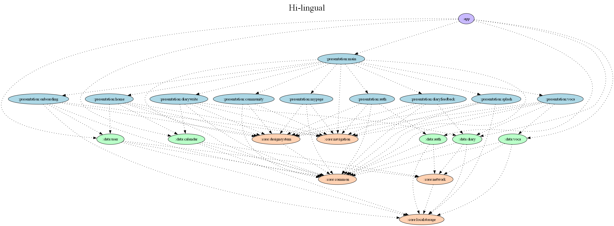

# Hilingual
<h2 align="center">AI 피드백으로 완성하는 나만의 영어 일기</h2>

<p align="center">
  
</p>

<br>

**‘Hilingual’** 은 영어 일기 작성에 대한 AI 피드백을 통해 사용자가 꾸준히 영어를 학습하고 실력을 향상시킬 수 있도록 돕는 앱 서비스입니다.
Hilingual과 함께 영어 일기 습관을 만들고, 자연스러운 영어 표현을 익혀보세요!

<br>

## MAIN FUNCTION


<br><br>

| 1️⃣ 영어 일기 주제 제공 | 2️⃣ 영어 일기 작성 |
|:---:|:---:|
 | 
> <i>매일 제공되는 새로운 주제로 영어 일기를 작성해보세요. 생각이 나지 않는 단어나 문장은 한글로 써도 괜찮아요. 사진을 첨부하여 더욱 생생한 기록을 남길 수도 있습니다.</i></br>

<br>

| 3️⃣ 작성한 일기에 대한 AI 피드백 제공 | 4️⃣ 나만의 단어장으로 복습 |
|:---:|:---:|
 | 
> <i> 작성한 일기에 대해 AI가 문법, 철자, 그리고 더 자연스러운 표현을 추천해줍니다. 내 영어 수준에 맞는 맞춤형 피드백으로 실력을 향상시켜 보세요. </i>

<br>

## CONTRIBUTORS
| 🤴한민재<br/>[@angryPodo](https://github.com/angryPodo) | 🦔김나현<br/>[@nahy-512](https://github.com/nahy-512) | 😻김나현<br/>[@nhyeonii](https://github.com/nhyeonii) |
|:---:|:---:|:---:|
|  |  |  |
| `스플래시`, `온보딩`<br/>`로그인`,`홈(캘린더)` | `일기 상세` | `단어장` |

| 🐻문지영<br/>[@Daljyeong](https://github.com/Daljyeong) | 🎓박효빈<br/>[@Hyobeen-Park](https://github.com/Hyobeen-Park) |
|:---:|:---:|
|  |  |
| `일기 작성` | `멘토` |

<br>


## SCREENSHOTS
|       뷰       |                                                      1                                                      |                                                              2                                                              |
|:-------------:|:-----------------------------------------------------------------------------------------------------------:|:---------------------------------------------------------------------------------------------------------------------------:|
| 로그인 <br> 온보딩 |   |  |                                                                                                                              |                                                                                                                             |
| 캘린더 |   |  |                                                |
| 일기작성 <br> AI 피드백  |   |  |       
|   일기, AI 피드백 확인   |  |  | 
|   단어장   |                                                                                  |  |                                                                                                            

<br>


## ARCHITECTURE
Hilingual은 Google의 권장 아키텍처 가이드를 따르며, **MVVM (Model-View-ViewModel)** 패턴을 기반으로 설계되었습니다. 데이터의 흐름을 단방향으로 관리하여 예측 가능하고 유지보수하기 쉬운 구조를 지향합니다.

**Presentation Layer ↔ Data Layer**

- **Presentation Layer**: UI와 관련된 로직을 처리합니다.
- **Data Layer**: 데이터 소스(네트워크, 로컬 DB)를 관리하고, 비즈니스 로직을 처리합니다. (Repository, DataSource)

<br>


## FOLDER STRUCTURE

```
Hi-lingual
├── app/                     // 앱 진입점
├── build-logic/            // 빌드 로직
├── core/                   // 공통 레이어
│   ├── common/
│   ├── designsystem/
│   ├── localstorage/
│   ├── navigation/
│   └── network/
├── data/                   // 데이터 레이어
│   ├── auth/              // 인증
│   ├── calendar/          // 캘린더
│   ├── diary/             // 일기
│   ├── user/              // 사용자
│   └── voca/              // 단어장
└── presentation/          // UI 레이어
    ├── auth/              // 인증 UI
    ├── community/         // 커뮤니티 UI
    ├── diaryfeedback/     // 일기 피드백 UI
    ├── diarywrite/        // 일기 작성 UI
    ├── home/              // 홈 UI
    ├── main/              // 메인 UI
    ├── mypage/            // 마이페이지 UI
    ├── onboarding/        // 온보딩 UI
    ├── splash/            // 스플래시 UI
    └── voca/              // 단어장 UI
```

## Module Dependency Graph



## TECH STACK

| Category        | Stack                                                  |
| :-------------- | :----------------------------------------------------- |
| **Architecture** | MVVM, Unidirectional Data Flow                        |
| **UI**           | 100% Jetpack Compose                                  |
| **DI**           | Hilt                                                  |
| **Asynchronous** | Coroutine, Flow                                       |
| **Navigation**   | Jetpack Navigation Compose (Type-safe)                |
| **Network**      | Retrofit2, OkHttp3, Kotlinx Serialization             |
| **Local DB**     | Room, DataStore                                       |
| **Image Loading**| Coil                                                  |
| **ETC**          | Timber, Lottie, ML Kit, Google Identity Service       |


## CONVENTION
> 프로젝트의 일관성과 효율적인 협업을 위해 아래 컨벤션을 준수합니다.

| 카테고리 | 문서 링크 |
|:---|:---|
| **기술 스택 컨벤션** | [Notion](https://seemly-cupcake-7b7.notion.site/216a178ee9bd8009b50ac5b8e8b285d7?source=copy_link) |
| **깃/브랜치 컨벤션** | [Notion](https://seemly-cupcake-7b7.notion.site/216a178ee9bd80f7a68defad28a7e071?source=copy_link) |
| **코드 컨벤션** | [Notion](https://seemly-cupcake-7b7.notion.site/216a178ee9bd80e4a706ce34866666f3?source=copy_link) |
| **패키지 컨벤션** | [Notion](https://seemly-cupcake-7b7.notion.site/216a178ee9bd80289994e9b31dae8274?source=copy_link) |
