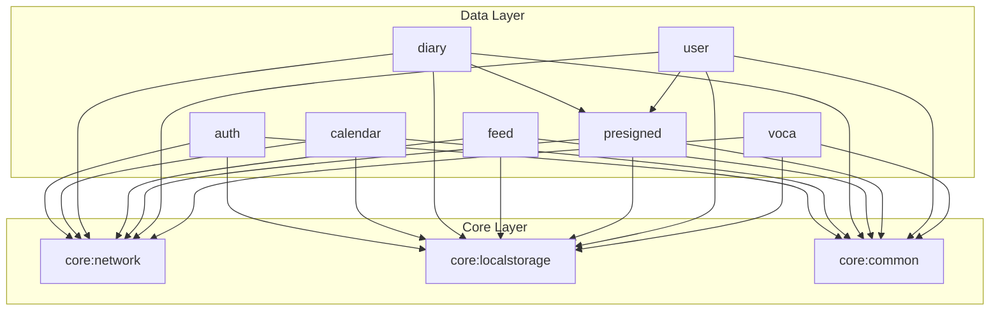
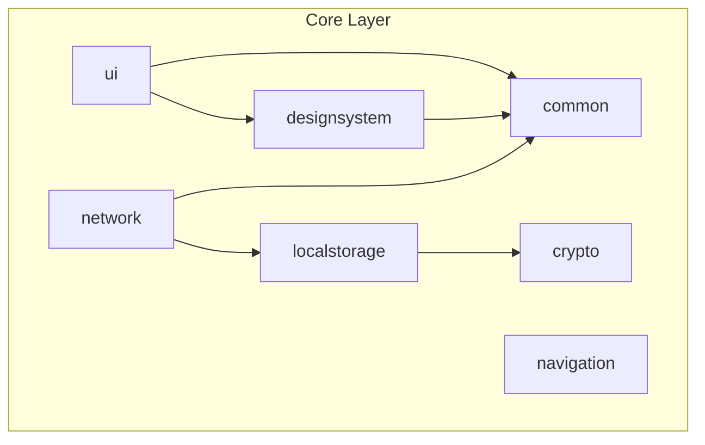

# Hi-lingual

**하이링구얼: 영어 일기, 기록**

  

> "영어를 부담스러운 공부가 아닌, 나를 표현하는 언어로 느낄 수 있도록"

하이링구얼은 일상 속 영어를 함께하는 일기 기록 서비스입니다.

- 시간에 쫓겨 영어 공부를 미루셨던 분
- 교과서 영어가 아닌 실생활 영어를 배우고 싶었던 분
- 일상 기록에 동기부여를 바라는 분

모두, 하루를 기록하며 영어를 나의 것으로 만들어보세요 😊

## Download

## Tech Stack

| Category | Stack |
| --- | --- |
| **Architecture** | Recommended App Architecture |
| **UI** | Jetpack Compose |
| **DI** | Dagger-Hilt |
| **Asynchronous** | Kotlin Coroutine, Flow |
| **Modularization** | Android App Modularization |
| **Build Configuration** | Gradle Version Catalog, Custom Convention Plugins |

## Module Dependency Graph

### High-Level Architecture

### Presentation Layer Dependencies

> **presentation:main** 모듈은 아래 그래프의 모든 Presentation 모듈을 포함하며,  
> 모든 Presentation 모듈은 공통적으로 **core:ui**와 **core:navigation** 모듈에 의존합니다.

```mermaid
graph TD
    subgraph Presentation Layer
        auth["auth"]
        diaryfeedback["diaryfeedback"]
        diarywrite["diarywrite"]
        feed["feed"]
        feeddiary["feeddiary"]
        feedprofile["feedprofile"]
        home["home"]
        mypage["mypage"]
        notification["notification"]
        onboarding["onboarding"]
        otp["otp"]
        splash["splash"]
        voca["voca"]
    end

    subgraph Data Layer
        data_auth["data:auth"]
        data_calendar["data:calendar"]
        data_diary["data:diary"]
        data_feed["data:feed"]
        data_user["data:user"]
        data_voca["data:voca"]
    end

    auth --> data_auth
    auth --> data_user
    diaryfeedback --> data_diary
    diarywrite --> data_calendar
    diarywrite --> data_diary
    feed --> data_feed
    feed --> data_diary
    feed --> data_user
    feeddiary --> data_diary
    feeddiary --> data_feed
    feeddiary --> data_user
    feedprofile --> data_feed
    feedprofile --> data_user
    feedprofile --> data_diary
    home --> data_user
    home --> data_diary
    home --> data_calendar
    mypage --> data_user
    mypage --> data_auth
    notification --> data_user
    onboarding --> data_user
    otp --> data_user
    otp --> data_auth
    splash --> data_auth
    splash --> data_user
    voca --> data_voca
    voca --> data_diary
```

### Data Layer Dependencies

### Core Layer Dependencies

## Contributors

| ğŸ¤´í•œë¯¼ì¬ [@angryPodo](https://github.com/angryPodo) | 🦔김나현 [@nahy-512](https://github.com/nahy-512) | 😻김나현 [@nhyeonii](https://github.com/nhyeonii) | 🐻문지영 [@Daljyeong](https://github.com/Daljyeong) | 🎓박효빈 [@Hyobeen-Park](https://github.com/Hyobeen-Park) |
| --- | --- | --- | --- | --- |
|  |  |  |  |  |
| `스플래시` `온보딩` `로그인` `홈(캘린더)` | `일기 상세` | `단어장` | `일기 작성` | `멘토` |

---

  Made with by Hi-lingual Team

