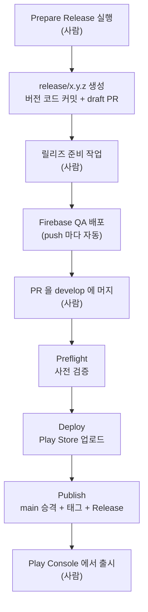

# 릴리즈 가이드

Play Store 배포 과정과 자동화 워크플로를 설명합니다.

## 브랜치 구조

| 브랜치 | 역할 |
| --- | --- |
| `develop` | 기본 브랜치. 모든 코드가 여기로 모입니다. |
| `release/x.y.z` | 릴리즈 준비용 임시 브랜치. 배포가 끝나면 삭제됩니다. |
| `main` | **배포된 커밋을 가리키는 포인터.** 자기만의 커밋을 갖지 않습니다. |

가장 중요한 원칙은 하나입니다.

> **main은 항상 develop의 조상입니다.**

릴리즈 산출물(버전 코드, 베이스라인 프로파일, 패치노트)이 develop에 먼저 들어가고, 배포가 성공한 뒤에 main이 그 커밋으로 따라옵니다. 두 브랜치가 각자 커밋을 갖지 않으므로 갈라질 일이 없고, main을 develop으로 되돌려 반영하는 단계도 존재하지 않습니다.

## 전체 흐름



사람이 하는 일은 네 가지뿐입니다. 릴리즈 시작, 준비 작업, PR 머지, 최종 출시입니다.

## 1. 릴리즈 시작

Actions 탭에서 **Prepare Release**를 실행하고 버전을 입력합니다.

- 버전은 `x.y.z` 형식이어야 합니다. (예: `2.8.0`)
- `versionCode`는 `major × 1000000 + minor × 10000 + patch × 100`으로 자동 계산됩니다. `2.8.0`이면 `2080000`입니다.
- 현재 값보다 낮거나 같은 버전, 이미 존재하는 `release/x.y.z` 브랜치는 거부됩니다.

워크플로가 아래를 만들어 줍니다.

1. develop에서 분기한 `release/x.y.z` 브랜치
2. `gradle/libs.versions.toml`의 버전을 올린 커밋
3. **base가 `develop`인** draft PR (릴리즈 체크리스트 포함)

## 2. 릴리즈 준비

`release/x.y.z` 브랜치에서 아래를 작업하고 커밋합니다.

- [ ] `./gradlew spotlessApply` 실행
- [ ] `./gradlew ktlintCheck` 통과
- [ ] 베이스라인 프로파일 재생성 (`app/src/release/generated/baselineProfiles/`)
- [ ] 포함된 기능들의 QA 완료 확인
- [ ] 패치노트 작성 (`fastlane/metadata/android/ko-KR/changelogs/default.txt`)

기능 QA는 develop에 머지되기 전 작업 브랜치에서 끝나므로, release 브랜치에서 QA 빌드를 다시 뿌리지 않습니다. 여러 기능이 합쳐진 상태를 한 번 더 보고 싶다면 **Deploy QA Build to Firebase**를 release 브랜치로 직접 실행하면 됩니다.

PR에서는 ktlint와 빌드 검증이 돌고, 릴리즈 PR에서는 `bundleRelease`까지 돌려 R8이 적용된 실제 배포 빌드가 통과하는지도 검증합니다.

> [!NOTE]
> 위 순서는 권장 순서일 뿐 강제되지 않습니다. **패치노트는 PR을 머지하는 시점까지만 채워져 있으면 됩니다.**
> 릴리즈 노트를 QA 이후에 받는다면 QA를 먼저 돌리고 나중에 커밋하셔도 됩니다.

### 사일로 기능 QA는 release 브랜치가 필요 없습니다

`release/x.y.z`는 스토어 배포용입니다. 개별 기능 QA는 작업 브랜치에서 바로 QA 빌드를 뽑으면 됩니다.

Actions 탭 → **Deploy QA Build to Firebase** → Run workflow → 브랜치 선택 후 실행합니다. 유닛 테스트를 돌리고 debug APK를 빌드해 Firebase App Distribution의 `qa-team` 그룹으로 배포합니다. QA 빌드의 릴리즈 노트에는 마지막 커밋 메시지가 자동으로 들어가므로, 여러 기능이 동시에 올라갈 때는 그것으로 구분합니다.

## 3. 머지

QA가 통과하면 draft를 해제하고 PR을 머지합니다.

> [!IMPORTANT]
> **머지 대상은 `main`이 아니라 `develop`입니다.**
> main으로 PR을 올리면 배포가 트리거되지 않습니다.

머지 방식은 develop 브랜치 룰셋에 따라 **Squash and merge**만 가능합니다. release 브랜치에서 작업한 커밋들이 하나로 합쳐져 develop에 커밋 하나로 올라가고, 그 커밋이 그대로 배포 대상이 됩니다.

## 4. 자동 배포

PR이 머지되면 **Release Publish** 워크플로가 세 단계로 진행됩니다.

### Preflight

빌드를 시작하기 전에 네 가지를 검사합니다. 여기서 막히면 아무것도 실행되지 않고 main도 움직이지 않습니다.

| 검사 | 실패하는 경우 |
| --- | --- |
| head 브랜치가 `release/`로 시작하는가 | 일반 PR이면 전체 스킵 (실패 아님) |
| main이 머지 커밋의 조상인가 | 히스토리가 갈라진 경우 |
| `v{버전}` 태그가 이미 있는가 | 버전을 올리지 않고 배포하려는 경우 |
| 패치노트가 비어 있지 않은가 | 패치노트 작성을 빠뜨린 경우 |

### Deploy

머지로 develop에 만들어진 커밋을 해시로 고정해, 그 시점의 코드로 AAB를 빌드하고 Play Store에 `draft`로 업로드합니다. 브랜치가 아니라 커밋 하나를 지목하기 때문에, 배포가 도는 동안 develop에 다른 PR이 머지되어도 섞여 들어가지 않습니다.

### Publish

**업로드가 성공한 뒤에만** 실행됩니다.

1. main을 머지 커밋으로 fast-forward
2. `v{버전}` 태그 생성
3. 패치노트를 본문으로 GitHub Release 생성

배포가 실패하면 main은 그대로 남습니다. 따라서 **main은 언제나 Play Store에 실제로 올라간 커밋을 가리킵니다.**

## 5. 출시

Play Store에는 `draft` 상태로 올라갑니다. Play Console에서 수동으로 출시해야 사용자에게 반영됩니다.

## 문제가 생겼을 때

### Preflight에서 막힌 경우

로그에 원인과 해결 방법이 출력됩니다. 히스토리가 갈라졌다는 오류라면 아래를 실행합니다.

```bash
git switch develop
git merge origin/main --no-ff -m "[CHORE] main 히스토리 정합화"
git push origin develop
```

### 빌드나 업로드가 실패한 경우

main은 움직이지 않았고 태그도 생성되지 않았으므로 재시도하면 됩니다.

코드를 고쳐야 한다면 새 릴리즈 PR을 만듭니다. 네트워크 오류처럼 일시적인 실패라면 Actions 탭에서 **Deploy to Play Store**를 직접 실행합니다. 이때 `ref` 입력란에는 **배포할 커밋의 해시**를 넣습니다.

커밋 해시는 릴리즈 PR을 머지할 때 develop에 만들어진 커밋의 ID입니다. PR 화면 맨 아래 `merged commit abc1234 into develop` 문구나 develop 커밋 목록에서 확인할 수 있습니다. 40자리 전체 대신 앞 7자리만 넣어도 됩니다.

머지 이후 develop에 새로 머지된 것이 없다면 `develop`이라고 입력해도 같은 커밋을 가리킵니다.

### main을 force push하거나 삭제해야 하는 경우

브랜치 룰셋으로 막혀 있고 bypass 대상이 없습니다. 저장소 관리자가 Settings → Rules에서 `main` 룰셋을 일시적으로 Disabled로 바꿔야 합니다.

## 워크플로 목록

| 워크플로 | 트리거 | 하는 일 |
| --- | --- | --- |
| `pr_checker.yml` | `develop`/`main` 대상 PR, `develop` push | ktlint, assembleDebug (릴리즈 PR은 bundleRelease 추가) |
| `deploy-qa.yml` | 수동 실행 | 유닛 테스트, Firebase App Distribution 배포 |
| `release-prepare.yml` | 수동 실행 | release 브랜치 생성, 버전 코드 커밋, draft PR 생성 |
| `release-publish.yml` | `develop` 대상 PR 머지 | 사전 검증 → 배포 호출 → main 승격, 태그, Release |
| `deploy-release.yml` | `release-publish`가 호출, 수동 실행 | AAB 빌드, Play Store 업로드 |

## 참고

- Play Store 업로드는 fastlane `upload_production` 레인이 담당하며 `release_status`는 `draft`입니다.
- 버전은 `gradle/libs.versions.toml`의 `versionCode`, `versionName`에서 관리합니다.
- 릴리즈 브랜치는 PR이 머지되면 자동으로 삭제됩니다.
